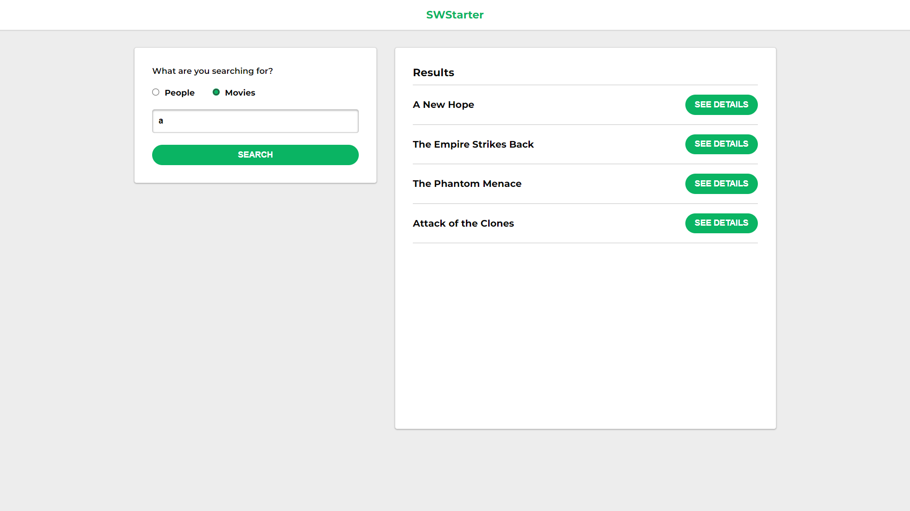

# Vue + PHP + Star Wars API

Simple sample application which runs a [Vue 3](https://vuejs.org/) client and a [PHP 8](https://www.php.net/) server, inside the same container, by using [Docker Compose](https://docs.docker.com/compose/). The API is built with [Slim](https://www.slimframework.com/) framework, and consumes data from the famous [SWAPI](https://swapi.dev/). The client application is built with [Vite](https://vitejs.dev/), and uses [Vue Router](https://router.vuejs.org/).



## Quick start

You need [Docker](https://www.docker.com/) running on your machine to quickly boot this sample application. In case you're using Windows, it's recommended to use [Docker Desktop](https://www.docker.com/products/docker-desktop) and enable the [WSL 2 backend](https://docs.docker.com/desktop/install/windows-install/).

With the requirements met, just run the following in a terminal:

```bash
docker-compose up --build
```

Then you can open the client application at http://localhost:3000 and look at the API endpoints at http://localhost:3001.

> **Note:** This sample application is intended to be used in a development environment only, since both container services will run using simple development servers, with no production optimizations, no minification, and with _hot-reloading_ enabled. It's not recommended to use this setup as is in production.

# Manually running

In case you don't want or can't use Docker for any reason, you still can run this application manually.

You'll need to have [PHP](https://www.php.net/) and [Composer](https://getcomposer.org/) installed on your machine for the API, and [Node.js](https://nodejs.org/) for the client web application.

## API

```bash
cd api
composer install
php -S localhost:3001 -t src
```

## Client

```bash
cd web
npm install
npm run dev --port 3000
```
